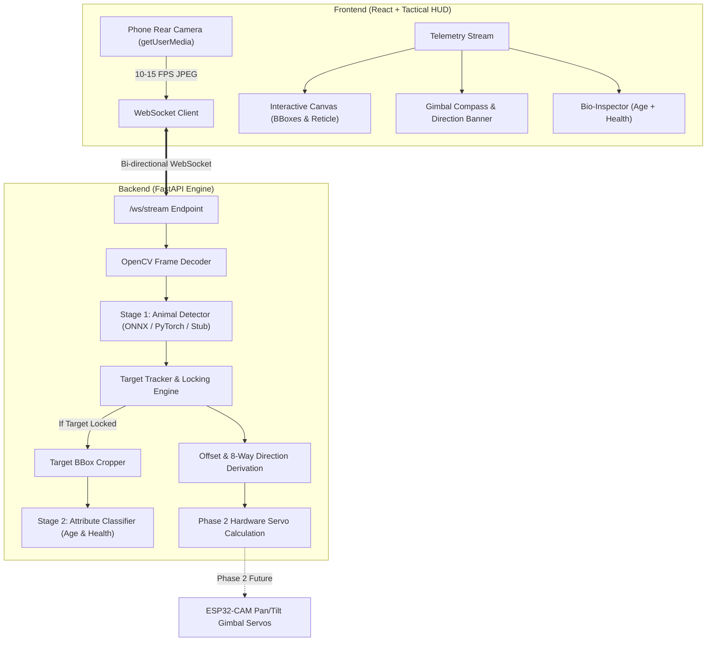

# 🎯 Real-Time Animal Detection & Target Locking System

A full-stack, low-latency computer vision and target tracking application built with a **FastAPI** backend, **WebSockets**, **OpenCV**, and a mobile-first **React + Vite** Tactical HUD frontend.

Architected in two distinct phases:
* **Phase 1 (Current)**: High-speed live video streaming from a smartphone's rear browser camera over WebSockets, two-stage AI inference, automated centroid/IoU target locking, and real-time directional telemetry HUD.
* **Phase 2 (Hardware-Ready)**: Direct swap of the video source to an **ESP32-CAM MJPEG** stream, with decoupled pan/tilt servo direction commands dispatched directly to hardware gimbal actuators.

---

## 🏗️ System Architecture



---

## ⚡ Tech Stack

* **Backend**: Python 3.10+, FastAPI, Starlette WebSockets, OpenCV (`cv2`), ONNX Runtime, PyTorch / Ultralytics YOLO, Pydantic Settings.
* **Frontend**: React 19, Vite, Plain Modern CSS (Cyberpunk Tactical HUD design system), Lucide Icons, Web Audio API sound synthesis.
* **Real-time Link**: Full-duplex WebSocket streaming binary JPEG frames and low-latency JSON telemetry.

---

## 🚀 Quickstart Guide

### 1. Backend Setup & Launch

1. Open a terminal in `/backend`:
   ```bash
   cd backend
   pip install -r requirements.txt
   ```
2. Start the FastAPI server (listening on all network interfaces `0.0.0.0` for LAN access):
   ```bash
   python -m uvicorn main:app --host 0.0.0.0 --port 8000
   ```
   > 💡 The backend automatically logs your local network IP (e.g. `192.168.1.45:8000`).

### 2. Frontend Setup & Launch

1. Open a second terminal in `/frontend`:
   ```bash
   cd frontend
   npm install
   npm run dev -- --host
   ```
2. Vite will launch with **HTTPS enabled** (via `@vitejs/plugin-basic-ssl`) and display the local network URL:
   ```
     ➜  Local:   https://localhost:5173/
     ➜  Network: https://192.168.1.45:5173/
   ```

---

## 📱 Testing on a Mobile Phone (Wi-Fi LAN)

Mobile browsers (**iOS Safari** and **Android Chrome**) strictly enforce security policies that require **HTTPS** (or `localhost`) to access camera hardware via `navigator.mediaDevices.getUserMedia`.

1. Connect your phone to the **same Wi-Fi network** as your computer.
2. Open the browser on your phone and navigate to:
   ```
   https://<YOUR_COMPUTER_IP>:5173
   ```
   *(e.g., `https://192.168.1.45:5173`)*
3. **Accept the Local SSL Certificate Warning**:
   * On iOS Safari: Tap **"Show Details"** → **"visit this website"**.
   * On Android Chrome: Tap **"Advanced"** → **"Proceed to 192.168.x.x (unsafe)"**.
4. Grant camera permission when prompted. The rear camera will start streaming frames to the backend, displaying live detection boxes and tracking telemetry!

---

## 🧠 Two-Stage AI Pipeline & Drop-in Weights

The backend features swappable model loaders in `backend/inference.py`:

```
backend/
└── models/
    ├── detector.onnx   # (Option A) Fast ONNX Runtime YOLOv8/v11
    ├── detector.pt     # (Option B) PyTorch Ultralytics weights
    ├── attribute.onnx  # Stage 2 Attribute Classifier
    └── attribute.pt    # PyTorch Stage 2 Attribute Classifier
```

### Stage 1: Animal Detector
* **Input**: Full BGR video frame.
* **Output**: Normalized bounding boxes `[x1, y1, x2, y2]`, class name, confidence score.
* **Fallback Stub**: When no weights are present, the intelligent stub simulator generates smooth, realistic animal trajectories across frames for immediate end-to-end testing.

### Stage 2: Target Attribute Classifier
* **Input**: Cropped bounding box of the currently locked target.
* **Output**: Age estimate (`Adult ~3-5 yrs`, `Sub-Adult`, `Juvenile`, `Senior`), health condition (`Healthy / Active`, `Resting`, `Monitored`), confidence rating, and biological details.

### Hot-Reloading
Drop weights into `backend/models/` while the server is running and click **"RELOAD MODELS"** in the UI settings drawer or send `POST /api/models/reload`.

---

## 🎯 Target Locking & Tracking Logic

1. **Acquisition**: On first detection (or when the user taps on any animal on screen), the tracker locks onto that target.
2. **Matching**: Every frame, the tracker calculates IoU and centroid Euclidean distance to track the target across motion.
3. **Offset Normalization**: Calculates normalized offset `(dx, dy)` from the frame center:
   * $dx \in [-1.0, +1.0]$: Negative = Target is Left, Positive = Target is Right.
   * $dy \in [-1.0, +1.0]$: Negative = Target is Up/Top, Positive = Target is Down/Bottom.
4. **8-Way Direction Derivation**: Derives discrete actuation command:
   * `CENTERED` (within configurable deadband, default 8%)
   * `UP`, `DOWN`, `LEFT`, `RIGHT`
   * `UP_LEFT`, `UP_RIGHT`, `DOWN_LEFT`, `DOWN_RIGHT`
5. **Lock-Loss Timeout**: If the target is obstructed or leaves the frame for $> 15$ consecutive frames (configurable), lock is dropped and state reverts to `SEARCHING`.

---

## 🤖 Phase 2 Hardware Integration (ESP32-CAM & Servos)

Phase 1 has been architected to make the Phase 2 hardware transition effortless:

1. **Decoupled Direction & Servo Telemetry**:
   Every frame returns a `hardware_command` object containing exact pan/tilt servo angles ($0^\circ$ to $180^\circ$):
   ```json
   {
     "pan_angle": 104.5,
     "tilt_angle": 82.0,
     "pan_delta": 3.6,
     "tilt_delta": -2.0,
     "action": "TRACK_UP_RIGHT"
   }
   ```
2. **Swapping Video Source**:
   In Phase 2, replace the WebSocket frame receiver in `main.py` with an `asyncio` task reading from the ESP32-CAM MJPEG stream (`http://<ESP32_IP>:81/stream`).
3. **Actuator Output**:
   Dispatch the computed `hardware_command.pan_angle` / `tilt_angle` directly to the ESP32 over UDP/HTTP or UART serial to drive pan/tilt servos.
